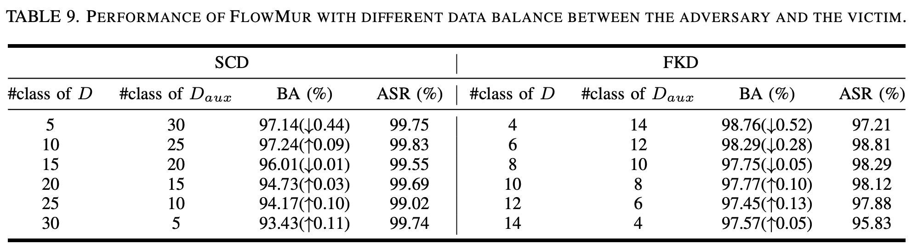
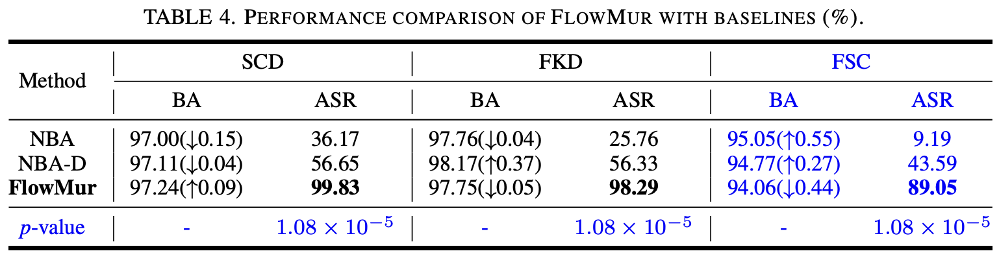
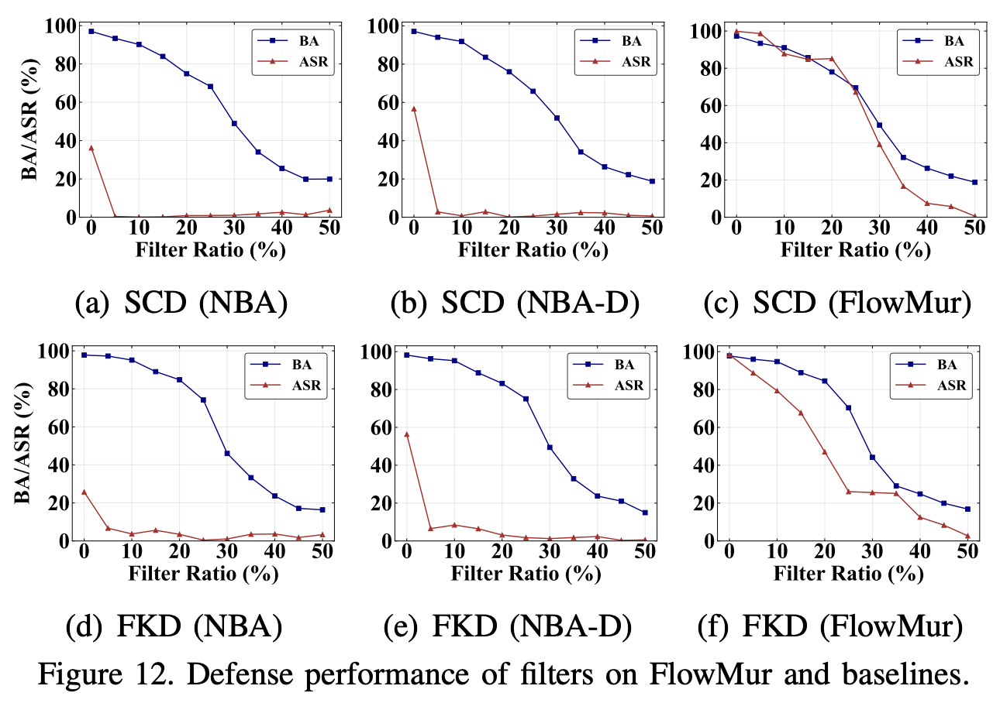
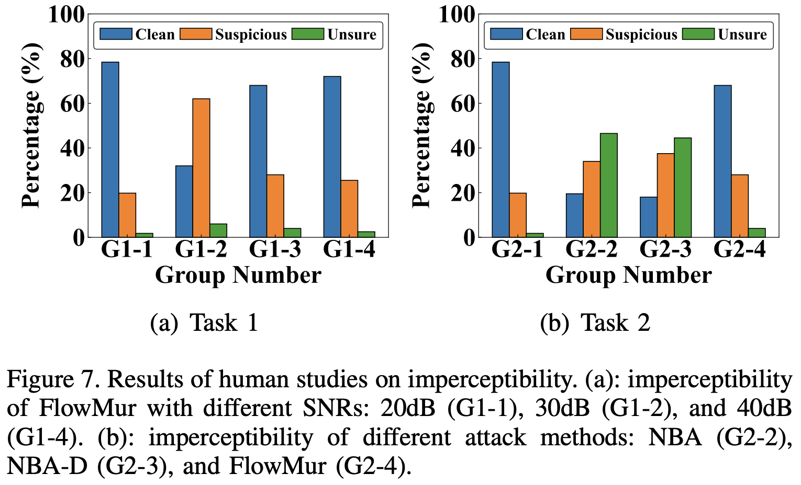
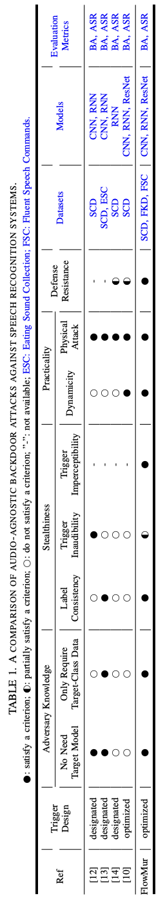
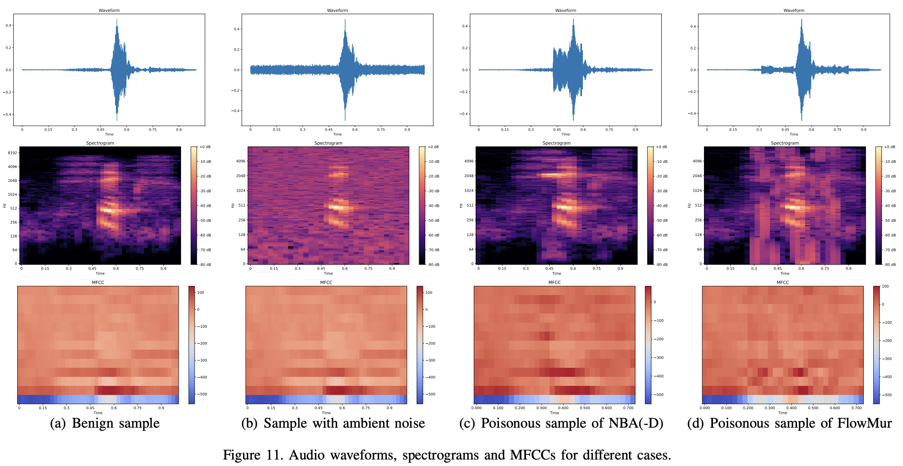

# FlowMur-Rebuttal

## C1: auxiliary dataset size (205A, 205B, 205D)

## C2: additional datasets with long sample duration (205A, 205B, 205C)

## C3: additional defense (205B, 205C)

## 205A_Response

## 205B_Response
### 1. *p*-values

### 2. SNR

## 205C_Response

## 205D_Response
### 1. Extended Table 1

### 2. Audio waveforms, spectrograms and MFCCs for different cases 

