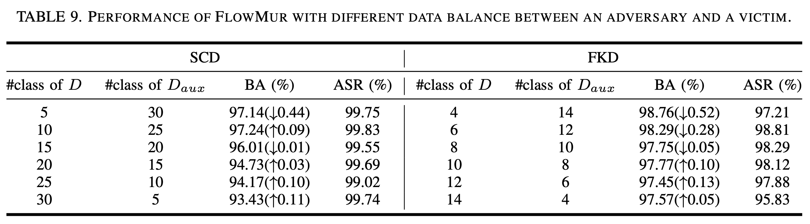
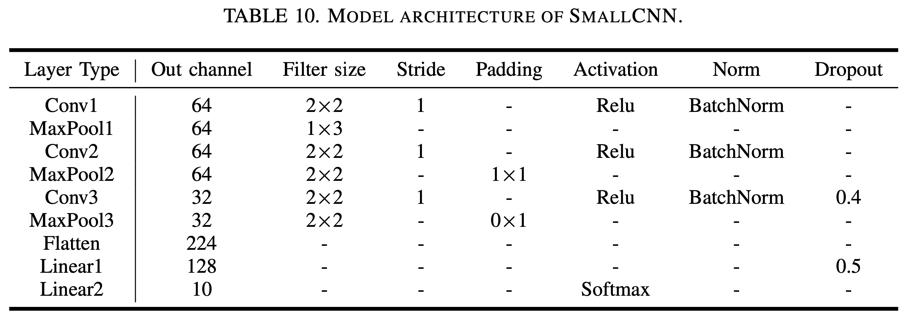
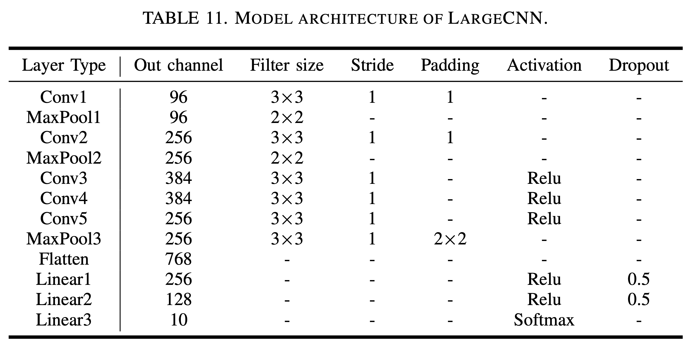
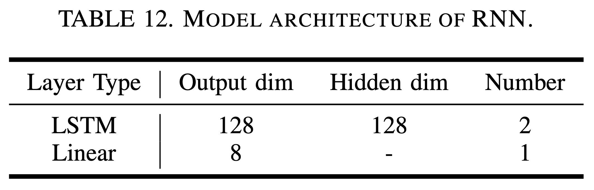
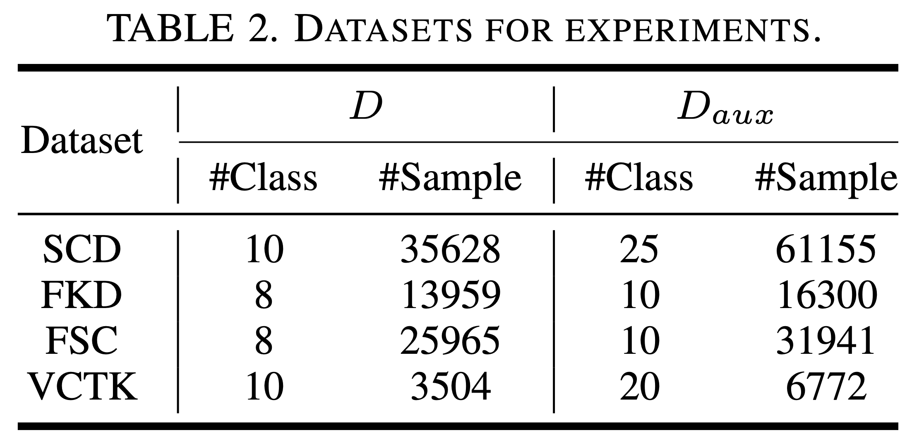

# FlowMur-Rebuttal

## C1: Auxiliary dataset size (205A, 205B, 205D)

## C2: Additional datasets with long sample duration (205A, 205B, 205C)

## C3: Additional defense (205B, 205C)
### 1. Defense performance of filters on FlowMur

### 2. Defense performance of Beatrix on FlowMur
* [Ma et al.](https://www.ndss-symposium.org/wp-content/uploads/2023/02/ndss2023_s69_paper.pdf) observed that although the infected model identifies both clean samples of the target class and poisonous samples as the target class, these two sets of samples are disjoint in the pixel space. Therefore, the intermediate representations of the poisonous samples differ from those of the clean samples. Based on this observation, [Ma et al.](https://www.ndss-symposium.org/wp-content/uploads/2023/02/ndss2023_s69_paper.pdf) proposed Beatrix, a defense method that leverages Gram Matrices to model the intermediate representations of samples, enabling the discrimination between benign and poisonous samples. Additionally, it further employs kernel-based testing to identify the infected label (i.e., the target class). Figure 14 demonstrates the defense performance of Beatrix on FlowMur and baselines. As shown in Figure 14, it is evident that the anomaly index of the infected label exceeds the predefined threshold on FKD for all three attack methods, indicating the effectiveness of Beatrix in defending against these attacks. From Fig. 14 we can see that the anomaly index of the infected label for all three attack methods are greater than the predefined threshold on FKD, indicating that Beatrix is effective for defending against all three attacks on FCK. However, for SCD, it becomes apparent that the anomaly index of the infected label in the case of FlowMur falls below the threshold, indicating Beatrix's inability to defend against FlowMur in the context of SCD.

## 205A_Response

## 205B_Response
### 1. *p*-values

### 2. Tests on speaker recognition

### 3. SNR

## 205C_Response

## 205D_Response
### 1. Extended Table 1

### 2. Audio waveforms, spectrograms and MFCCs for different cases 

### 3. An attack example of FlowMur 

### 4. Experimental settings and datasets statistics

